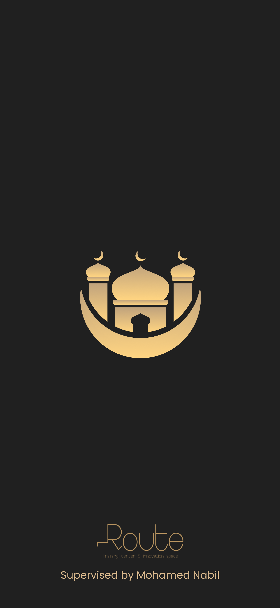
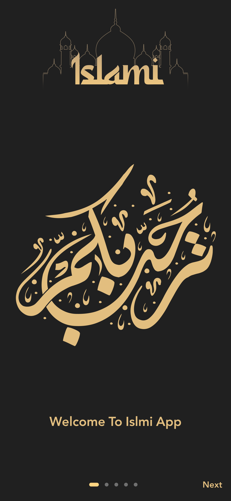
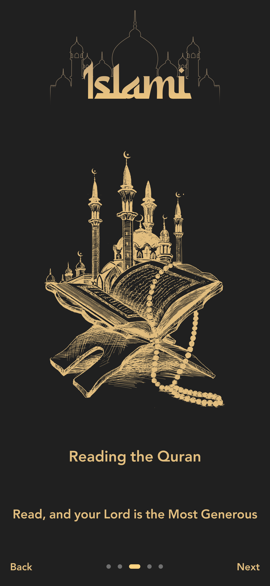
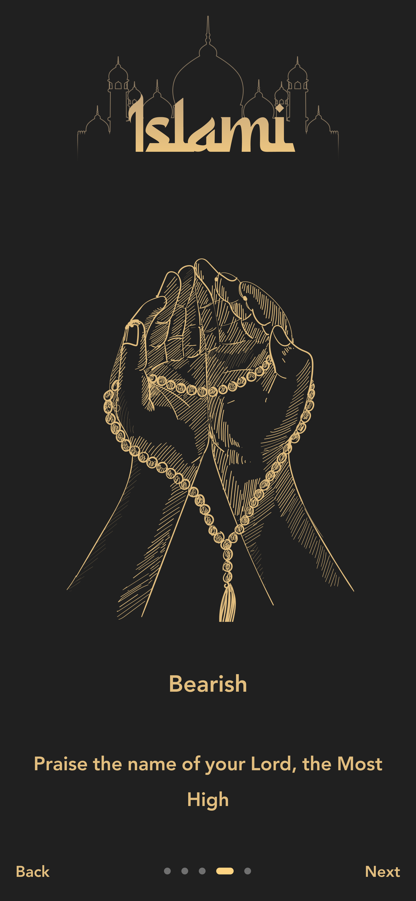
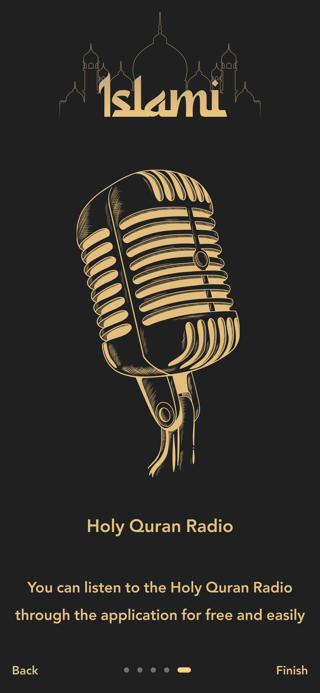
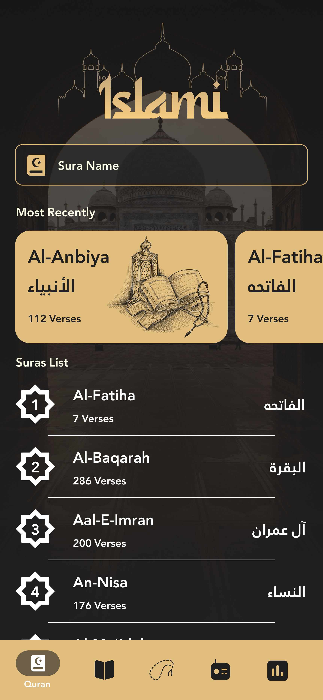
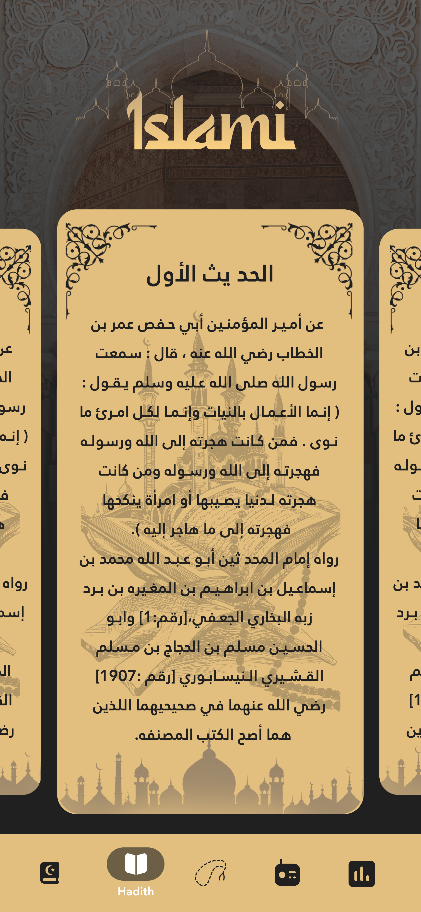
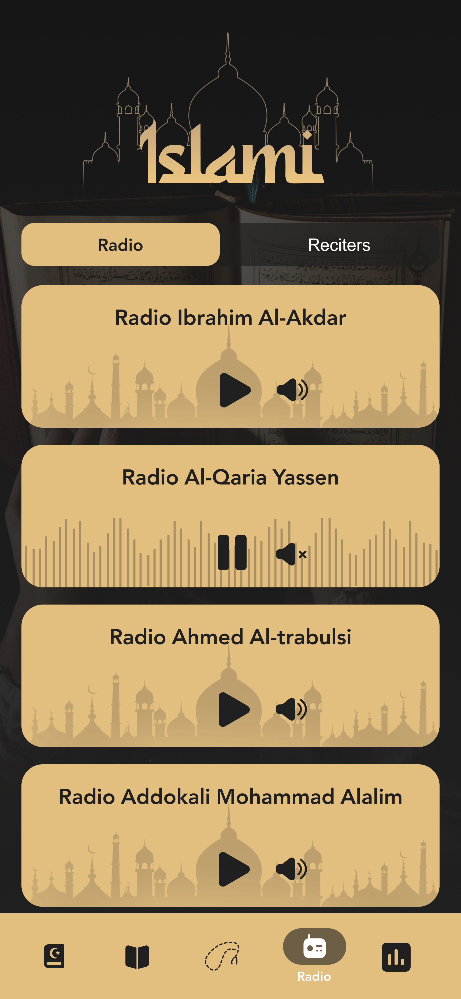
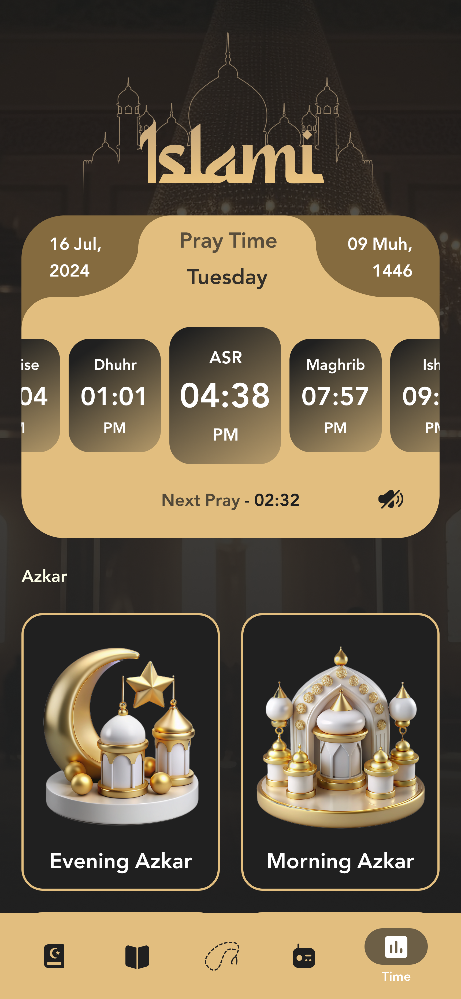

# 🕌 **Islami App**

_Islami App_ is a comprehensive Islamic application built as part of a course project.  
It provides a variety of useful features for daily Islamic practices, including **Quran Reading**, **Hadith**, **Tasbeeh**, **Prayer Times**, and **Radio**.

---

## 🛠️ **Built With**

---

## ✨ **Key Features**

### 📱 **Splash Screen**
- Two optimized versions for Android:
  - Devices **under 12 inches**
  - Devices **12 inches and above**

🖼️**Preview:**

  
  

---

### 🧭 **Introduction Screens**
- A set of 5 onboarding screens introducing the app’s main features.
- Modern UI and simple navigation.

🖼️ **Preview:**

  
  
  
  
  

---

### 🏠 **Home Screen (Tabs)**

#### 📖 **Quran Tab**
- Search bar for quick access to Surahs.  
- Recently viewed Surahs section.  
- Access to all 114 Surahs.  
- Tap any Surah to read its full content.

#### 📜 **Hadith Tab**
- Contains 50 authentic Hadiths.  
- Tap any Hadith to view detailed content.

#### 🔢 **Tasbeeh Tab**
- Digital counter for Zekr (**Tasbeeh, Tahmeed, Takbeer, ets**).  
- Zekr text automatically changes every 33 counts.

#### 📻 **Radio Tab**
- Displays a list of Islamic radio stations.  
- *(Future plan: integrate live streaming API.)*

#### 🕰 **Time Tab**
- Displays daily prayer times.  
- Shows both Hijri and Gregorian dates.  
- Includes Azkar for morning, evening, and before sleep.

🖼️ **Preview:**

  
  
  
  
  

---
**🚀 Installation / How to Run**

Follow these steps to run the app locally:

**1. Clone the repository**

git clone https://github.com/rahmafadl/islami_app.git

**2. Navigate to the project folder**

cd islami_app

**3. Install dependencies**

flutter pub get

**4. Run the app**

flutter run

---
**🔮 Future Updates**

- Integrate live radio streaming API

- Add notifications for prayer times

- Improve UI for tablets and larger screens

- Add more Azkar, Duas, and features in Tasbeeh tab

---

## 📬 Contact / Feedback

For any questions, suggestions, or feedback:

**Email:** rahmafadl200@gmail.com  
**GitHub:** https://github.com/rahmafadl

---
